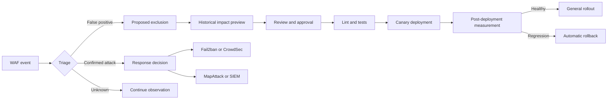
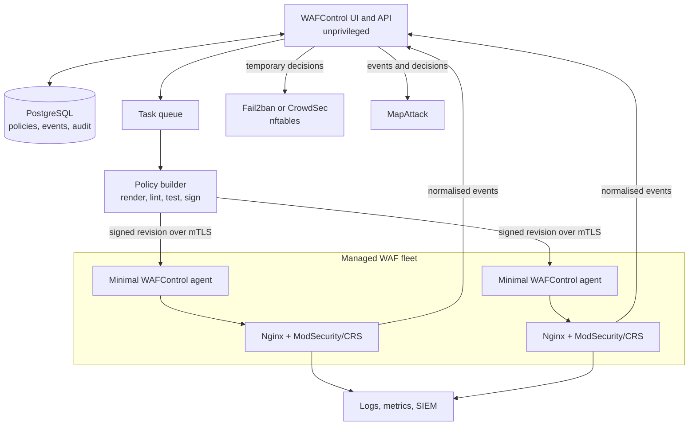

# WAFControl Evolution Roadmap

- Status: proposal maintained by the `amassi-network/wafcontrol` fork
- Last updated: 9 August 2026
- Reference environment: Nginx, ModSecurity v3, and OWASP Core Rule Set 4.x

> [!IMPORTANT]
> This document is a proposed evolution plan. It has not yet been adopted as the
> official OWASP WAFControl roadmap. The objective is to develop the work in
> small, reviewable contributions and offer suitable changes upstream.

## Executive summary

WAFControl is a promising open-source dashboard for ModSecurity and the OWASP
Core Rule Set (CRS). It already provides attack views, rule browsing, basic CRS
configuration, custom rules, and local version management.

The current product does not yet provide the complete operational lifecycle
needed to manage WAF policies safely in production. The most important gap is
not another chart. It is a controlled workflow from an observed event to a
minimal exclusion, reviewed policy revision, validated deployment, and safe
rollback:

```text
event -> triage -> minimal exclusion -> review -> validation
      -> canary deployment -> observation -> promotion or rollback
```

The proposed direction is to evolve WAFControl into a self-hosted control plane
for open WAF engines, starting with ModSecurity and CRS and leaving room for a
future Coraza adapter. It should not become a new WAF engine, a CRS fork, a
general-purpose SIEM, or a replacement for Nginx.

The immediate priorities are:

1. make configuration changes safe, versioned, testable, and reversible;
2. add first-class CRS exclusions and IP/CIDR lists with precise scopes;
3. connect every security event to a triage and remediation workflow;
4. manage policies per application and then across multiple WAF nodes;
5. expose stable integrations for Fail2ban, CrowdSec, SIEMs, and MapAttack;
6. add governance controls: RBAC, approvals, audit history, and a public API;
7. consider advanced API, bot, rate-limit, and learning capabilities only after
   the policy lifecycle is reliable.

## Evidence from the production pilot

This roadmap is informed by a controlled deployment protecting an Nginx site
with ModSecurity v3 and CRS 4.28.0 in `DetectionOnly` mode.

The pilot confirmed that WAFControl can ingest ModSecurity events and provide a
useful initial view of CRS activity. It also exposed several operational gaps:

- no dedicated allowlist or blocklist interface for IPv4, IPv6, and CIDRs;
- no explicit distinction between trusted traffic, WAF bypass, and blocking;
- no rule exclusion scoped to a host, route, method, parameter, or JSON field;
- no event-to-exclusion workflow;
- no owner, reason, review date, or expiry for exceptions;
- no impact preview before applying an exclusion;
- no application-specific policy model;
- no multi-node inventory, drift detection, canary rollout, or rollback;
- no comprehensive change audit trail;
- no stable API for automation or external security platforms;
- the web application and deployment operations are not sufficiently separated
  by privilege;
- mutating views in the audited revision use CSRF exemptions;
- direct CRS file editing risks losing local changes during an update;
- database migrations and upgrade procedures need further industrialisation.

### Confirmed CRS version-state inconsistency

The dashboard reported:

```text
Active Server: Nginx
A newer version of CRS is available: 4.25.1
```

The active installation was already CRS 4.28.0. Clicking Update caused the
backend to report:

```text
[+] Detected server: nginx
[+] Latest CRS version: v4.28.0
[=] CRS v4.28.0 already present at /etc/nginx/modsec/coreruleset-4.28.0. Skipping download.
[=] Dashboard exclusions already present.
[+] Updating /etc/nginx/modsec/main.conf
[+] Testing web server configuration...
[+] Reloading nginx...
[✓] Updated to v4.28.0 and nginx reloaded.
```

The backend found the correct latest version, but still rewrote configuration
and reloaded Nginx even though no update was required. WAFControl should manage
and reconcile these states separately:

| State                 | Meaning                                            |
| --------------------- | -------------------------------------------------- |
| `latest_available`    | Latest verified release from the configured source |
| `downloaded_versions` | Versions available locally                         |
| `configured_version`  | Version referenced by generated configuration      |
| `active_version`      | Version actually loaded by the web server          |
| `reported_version`    | Version reported by each managed node              |

Version comparisons must use normalised semantic versions, including values
with or without a leading `v`. A no-change update must be idempotent: it must not
rewrite configuration or reload the web server.

## Market expectations

This project does not need to reproduce every commercial WAF feature. However,
several capabilities have become normal expectations for a WAF control plane:

- Cloudflare provides conditional managed-rule exceptions, reusable IP/host/ASN
  lists, security-event filtering, and rule creation from current event filters.
- AWS WAF treats IP sets, rule groups, Count mode, labels, Allow, Block,
  CAPTCHA, and Challenge as explicit policy objects and actions.
- F5 WAF for NGINX uses declarative, schema-validatable policies, structured
  security logs, policy staging, sensitive-field masking, API protections, and
  custom signature sets.
- BunkerWeb manages multiple services, detect/block modes, bans, configuration
  validation, users, roles, plugins, jobs, and upgrades through a control plane.
- open-appsec provides Learn/Detect/Prevent workflows and derives exceptions
  from fields in an observed event.
- CrowdSec models temporary decisions, scopes, durations, reasons, central
  allowlists, blocklists, and remediation-component health.

Useful primary references:

- [OWASP CRS false-positive tuning](https://coreruleset.org/docs/2-how-crs-works/2-3-false-positives-and-tuning/)
- [Cloudflare WAF exceptions](https://developers.cloudflare.com/waf/managed-rules/waf-exceptions/)
- [Cloudflare Security Events](https://developers.cloudflare.com/waf/analytics/security-events/)
- [AWS WAF documentation](https://docs.aws.amazon.com/waf/)
- [F5 WAF for NGINX policy configuration](https://docs.nginx.com/waf/policies/configuration/)
- [BunkerWeb Web UI](https://docs.bunkerweb.io/latest/web-ui/)
- [open-appsec custom rules and exceptions](https://docs.openappsec.io/setup-instructions/setup-custom-rules-and-exceptions)
- [CrowdSec decision management](https://docs.crowdsec.net/u/console/decisions/decisions_management/)

## Product boundaries

### WAFControl should become

- an inventory of protected applications, nodes, engines, and versions;
- a triage interface for WAF events;
- a generator of correct, minimal CRS exclusions;
- a manager for reusable policies and address lists;
- an orchestrator for validation, rollout, health checks, and rollback;
- a stable API and event source for MapAttack, SIEMs, and response tools;
- a fully self-hosted product with no mandatory SaaS dependency.

### WAFControl should not become

- a new WAF engine;
- a fork of OWASP CRS;
- a replacement for Nginx or Apache;
- a general-purpose SIEM;
- a complete Internet reputation database;
- a general network-firewall manager;
- an interface that hides broad security bypasses behind an ambiguous
  “whitelist” button.

## Target domain model

| Object                | Purpose                                                      |
| --------------------- | ------------------------------------------------------------ |
| `Node`                | Managed WAF node, engine, versions, capabilities, and health |
| `Application`         | Protected service, domains, routes, owner, and criticality   |
| `Policy`              | Logical security configuration reusable across applications  |
| `PolicyBinding`       | Versioned assignment of policy to applications and nodes     |
| `RulePackage`         | Versioned CRS or custom-rule package                         |
| `RuleExclusion`       | Global or conditional exclusion with scope and rationale     |
| `AddressList`         | Named list of IPs, CIDRs, and later optional ASNs            |
| `AddressEntry`        | List entry with source, expiry, and comment                  |
| `SecurityEvent`       | Normalised event received from a WAF engine                  |
| `TriageDecision`      | Human or automated classification of an event                |
| `RemediationDecision` | Temporary ban, unban, challenge, or related action           |
| `ConfigRevision`      | Immutable rendered policy revision                           |
| `Deployment`          | Application of a revision to a set of nodes                  |
| `AuditEntry`          | Append-only record of a security-sensitive operation         |
| `Integration`         | MapAttack, webhook, syslog, SMTP, or other connector         |

## First-class CRS exclusions

WAFControl must stop modifying vendor CRS files in the normal workflow. The
[OWASP CRS tuning documentation](https://coreruleset.org/docs/2-how-crs-works/2-3-false-positives-and-tuning/)
explicitly discourages direct edits because updates overwrite them.

Generated policy must use separate managed files:

- **before CRS** for conditional runtime exclusions;
- **after CRS** for static rule and target exclusions;
- a WAFControl-owned, versioned directory independent of CRS source files.

An exclusion should support scopes such as application, virtual host, node or
node group, exact path, prefix or regular expression, HTTP method, source list,
WAF variable, CRS rule ID/range/tag, and validity period.

The UI should render the scope as an understandable sentence before approval:

```text
On ironitia.com only, for POST /api/contact,
remove ARGS:description from rule 942100,
until 30 September 2026.
```

The exclusion assistant must propose the narrowest effective change:

1. remove one variable from one rule;
2. if that is impossible, remove one rule for one route;
3. if necessary, remove a tag for a narrow scope;
4. propose global rule removal only as a last resort.

## Explicit address-list semantics

“Whitelist” is ambiguous and can cause unintended security bypasses. WAFControl
should expose explicit actions:

- **Trusted**: do not ban through response tooling, but keep WAF inspection;
- **WAF bypass**: intentionally disable inspection for a narrow scope;
- **Block**: reject the request;
- **Observe**: label and log without blocking;
- **Rate profile**: apply a specific rate-limit policy.

Every entry should support IPv4, IPv6, CIDR, mandatory rationale, author,
source, application scope, start time, expiry, and status. Full WAF bypass must
require a stronger warning and approval.

Large and short-lived hostile-address sets belong in nftables/ipset, Fail2ban,
or CrowdSec. ModSecurity remains responsible for application-aware decisions,
not high-volume reputation feeds.

## Event-to-policy workflow



An event detail view should provide transaction ID, node, application, client
address, host, method, normalised URI, triggered rules and tags, anomaly score,
theoretical decision, applied decision, policy version, and carefully redacted
evidence. It should also show related events and offer explicit triage actions.

Before saving an exclusion, the UI should display the generated directive,
placement before or after CRS, affected nodes and applications, historical
events that would have changed, suspicious events that would also be ignored,
risk, reviewer, and expiry.

## Target architecture



The Django application and ordinary workers must not run as root. A small,
separate agent should be the only component allowed to write managed policy,
run an approved validator, execute `nginx -t`, reload the web server, and
restore the previous revision. The agent must accept structured, authenticated,
signed operations only—never arbitrary shell commands.

## Priorities

### P0 — Required before blocking mode

#### Safe policy lifecycle

- immutable revisions and readable diffs;
- SecLang linting and engine-specific validation;
- atomic writes and deployment locking;
- `nginx -t` or equivalent before every reload;
- automatic backup and rollback;
- no reload when rendered configuration did not change;
- post-deployment health and checksum verification.

#### CRS exclusions

- exclusion by ID, range, and tag;
- removal of a specific target;
- scope by host, URI, method, source, and variable;
- correct before/after CRS generation;
- rationale, owner, review date, and expiry;
- warnings for exclusions invalidated by a CRS update.

#### Address lists

- IPv4, IPv6, and CIDR validation;
- named reusable lists;
- Trusted, WAF bypass, Block, and Observe actions;
- expiry, CSV import/export, and API access;
- protection against locking out administration and monitoring sources;
- safe handling of client addresses behind trusted proxies.

#### Per-application policies

- application and virtual-host inventory;
- Off, DetectionOnly, or On per application;
- paranoia level and anomaly threshold per application;
- shared policy inheritance with visible local overrides.

#### WAFControl security baseline

- remove unjustified CSRF exemptions;
- run UI and workers without root privileges;
- introduce a minimal privileged agent;
- validate every path and filename;
- prevent writes outside managed directories;
- version database migrations;
- lock dependencies and scan them for vulnerabilities;
- document and test backup and recovery.

### P1 — Required for operating multiple services

- advanced event search, grouping, comments, assignment, and triage status;
- clear separation of `would_block`, `blocked`, `allowed`, and `bypassed`;
- multi-node enrolment using mutual TLS;
- node groups, tags, environments, health, version, and configuration checksum;
- configuration-drift detection and canary/batched deployment;
- Viewer, Analyst, Policy Editor, Approver, and Administrator roles;
- append-only audit log and separation of proposal from approval;
- optional OIDC/SAML SSO and revocable sessions;
- versioned REST API with an OpenAPI schema;
- scoped service tokens and signed, retryable webhooks;
- MapAttack, syslog, Loki/SIEM, SMTP, Fail2ban, and CrowdSec integrations;
- persistent delivery queues and dead-letter handling;
- verified CRS downloads, semantic versions, release notes, staging, and rollback.

### P2 — Important differentiation

- application and authentication rate-limit profiles;
- protection against brute force and credential stuffing;
- verified bots, bot categories, graduated Log/Throttle/Challenge/Block actions;
- OpenAPI import and observed endpoint inventory;
- undocumented-route and unsupported-method detection;
- JSON, JWT, GraphQL, gRPC, and WebSocket controls where supported;
- versioned custom-rule packages and virtual patches with mandatory tests;
- sensitive-field masking, retention policies, and controlled export.

### P3 — Research and advanced capabilities

- assisted learning of legitimate traffic profiles;
- exclusion suggestions with confidence scores, never silently applied;
- campaign detection and behavioural similarity;
- IP/ASN reputation supplied by MapAttack;
- anonymised request replay;
- bypass testing with OWASP WAF-A-MoLE;
- experimental Coraza support;
- automatic analysis of rule performance cost.

## Delivery phases

### Phase 0 — Stabilise the foundation

- document architecture, threat model, and supported deployment modes;
- commit and test database migrations;
- fix CSRF and path-validation weaknesses;
- establish unit, integration, and security tests;
- add immutable configuration revisions and audit entries;
- prevent direct vendor-CRS edits in the standard workflow;
- design the minimal privileged agent.

Exit criterion: no WAF mutation can be applied without validation, history, and
a recoverable previous state.

### Phase 1 — Exclusions and address lists

- add address-list and CRS-exclusion models and UI;
- add event-to-exclusion assistance;
- generate separate before/after CRS files;
- add expiry, rationale, diff, local validation, and rollback;
- validate with real DetectionOnly events from pilot applications.

Exit criterion: a false positive on one route can be corrected without editing
CRS or reducing protection on unrelated routes.

### Phase 2 — Applications and policies

- implement Application, Policy, and PolicyBinding;
- support engine mode, paranoia level, and thresholds per application;
- support inheritance and versioned custom-rule packages;
- add application dashboards and regression tests.

Exit criterion: two virtual hosts on one server can use different policies and
exclusions without uncontrolled duplication.

### Phase 3 — Multi-node agents

- implement a minimal agent and mTLS enrolment;
- add inventory, health, version, and drift reporting;
- sign revisions and deploy by canary and batches;
- support safe offline operation and certificate rotation.

Exit criterion: a revision can be deployed to a pilot node, measured, promoted,
or rolled back independently.

### Phase 4 — Response and MapAttack

- define a stable event and decision schema;
- export signed, idempotent batches to MapAttack;
- add buffered webhooks and delivery status;
- integrate temporary Fail2ban/CrowdSec ban and unban decisions;
- synchronise trusted lists;
- optionally accept signed, scoped, expiring decisions from MapAttack.

Exit criterion: every ban and unban is explainable, time-bounded, correlated to
evidence, audited, and reversible.

### Phase 5 — Governance and ecosystem

- complete RBAC, approvals, SSO, API, CLI, and GitOps workflows;
- publish plugin interfaces and developer documentation;
- add an experimental Coraza adapter;
- upstream suitable changes as small independent contributions.

### Phase 6 — Advanced protection

- OpenAPI discovery and enforcement;
- rate limiting and authentication protections;
- bot controls and challenges;
- virtual patching;
- replay, fuzzing, and policy optimisation.

## Proposed release sequence

The exact version numbers remain subject to maintainer agreement. A practical
sequence for this fork would be:

- **1.0.1**: CRS version-state fix, idempotent updates, CSRF fixes, migrations;
- **1.1.0**: safe CRS exclusions, address lists, immutable revisions, audit;
- **1.2.0**: per-application policies, triage workflow, rollback;
- **1.3.0**: public API, MapAttack export, Fail2ban/CrowdSec integrations;
- **2.0.0**: privileged agent and multi-node control plane.

Each release should include versioned migrations, upgrade and rollback notes,
Nginx and Apache tests, a ModSecurity/CRS compatibility matrix, changelog,
reproducible artefacts, checksums, an SBOM, and user/operator documentation.

## Collaboration and governance

Development should remain open and reviewable:

1. open an issue before implementing a significant capability;
2. use a short RFC or architecture decision record for cross-cutting changes;
3. keep pull requests small and independently testable;
4. require migrations, tests, documentation, and upgrade notes with code;
5. use a Developer Certificate of Origin (`Signed-off-by`) for contributions;
6. disclose exploitable security issues privately before publishing details;
7. test changes in a reproducible lab and then in DetectionOnly canaries;
8. publish release candidates before promoting stable releases;
9. maintain a public project board and decision log;
10. offer suitable changes to the upstream OWASP WAFControl project.

A small working group should cover product/operations, ModSecurity/CRS,
Django/API, frontend/UX, security review, and release engineering. Production
evidence must be anonymised before it enters public issues or test fixtures.

## Minimum acceptance criteria

### Exclusions

- an exclusion affects only its declared application, route, and variable;
- CRS upgrades do not overwrite managed exclusions;
- missing or changed CRS IDs are reported;
- expired exclusions are no longer rendered;
- broad/global exclusions require stronger approval;
- author, rationale, time, review, and history are always available.

### Address lists

- strict IPv4, IPv6, and CIDR validation;
- explicit and tested distinction between Trusted, WAF bypass, and Block;
- automatic expiry;
- consistent state across subscribed nodes;
- protected administration sources and correct trusted-proxy handling.

### Deployment

- no partially written active policy;
- no reload after a failed configuration test;
- tested automatic rollback;
- revision and node checksums match;
- local drift is detected;
- concurrent deployments are serialised;
- loss of the control plane does not interrupt protected applications.

### CRS version lifecycle

- 4.28.0 compares correctly with 4.25.1, with or without `v`;
- stale remote data is identified and refreshable;
- dashboard and worker use one source of truth;
- available, downloaded, configured, and active versions are shown separately;
- Update performs no write or reload when the target is already active;
- a real update verifies active path, version, and checksum after reload;
- expected/active divergence produces an alert;
- rollback restores the exact previous version and policy revision.

### Control-plane security

- all mutations have CSRF protection and server-side authorisation;
- no user-controlled path permits arbitrary file access;
- secrets are absent from logs;
- the agent cannot execute arbitrary shell commands;
- ordinary analysts cannot alter the audit log;
- backup and recovery are tested;
- CI includes dependency, static, API, and deployment security tests.

## Initial contribution backlog

1. Document the missing rule-toggle actions in the current UI.
2. Fix CRS version detection, semantic comparison, and idempotent updates.
3. Remove unsafe CSRF exemptions and add regression tests.
4. Commit and validate Django migrations.
5. Add `ConfigRevision` and append-only `AuditEntry` foundations.
6. Add a `RuleExclusion` model without deployment side effects.
7. Implement and test the exclusion renderer.
8. Add the local exclusion workflow and impact preview.
9. Add address lists and explicit action semantics.
10. Add safe validation, deployment, and rollback.
11. Add versioned event and decision APIs.
12. Implement the remote agent as a separately reviewable component.

## Short-term recommendation

Keep production pilots in `DetectionOnly` until the P0 controls are complete.
Do not use direct CRS file editing to tune false positives. The first functional
prototype should be deliberately limited to:

1. event triage;
2. narrowly scoped CRS exclusions;
3. Trusted, Block, and WAF bypass lists with expiry;
4. separate managed configuration files;
5. diff, validation, atomic reload, and rollback;
6. an audit trail;
7. structured MapAttack export.

This scope delivers the operational capability needed during the first 7–14
days of WAF observation while establishing a safe foundation for everything
that follows.
