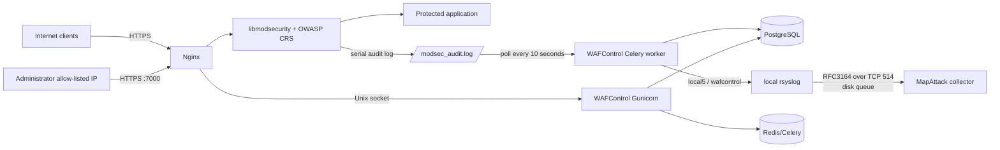

# Reproducible WAFControl deployment

This runbook is the authoritative procedure for reproducing the Ironitia
WAFControl, ModSecurity, CRS and MapAttack syslog integration on another
Ubuntu server. It is written so that an operator or another automation agent
does not need the original conversation.

Never copy passwords, Django secrets, certificates, application exclusions or
database dumps between sites without explicit authorisation.

## 1. Architecture and data flow



The dashboard is not in the request path of the protected application. An
outage of WAFControl, PostgreSQL, Redis or the remote syslog collector must not
interrupt Nginx. Rsyslog retains unsent events in a bounded disk queue.

## 2. Supported reference baseline

The validated production baseline on 2026-08-22 is:

| Component | Reference |
|---|---|
| Operating system | Ubuntu Server 24.04 LTS |
| Nginx | Ubuntu package 1.24.x |
| ModSecurity connector | `libnginx-mod-http-modsecurity` 1.0.3 |
| libmodsecurity | 3.0.12 |
| OWASP CRS | 4.29.0, pinned |
| Python | 3.12 |
| Django | 5.2.8 |
| PostgreSQL | 16 |
| Redis | 7 |
| rsyslog | 8.2312 |
| WAFControl code | a reviewed Git tag or exact commit from this fork |

Later compatible package revisions can be used, but must be recorded in the
deployment evidence. Do not silently deploy the branch head.

## 3. Required site inputs

Obtain and record these values before changing the target server:

| Variable | Meaning | Example only |
|---|---|---|
| `WAF_DOMAIN` | DNS name used by the dashboard | `waf.example.net` |
| `WAF_PUBLIC_IP` | target public IPv4 and sensor identity | `192.0.2.10` |
| `WAF_ADMIN_ALLOW_IP` | administrator IPv4/IPv6 CIDR | `198.51.100.8/32` |
| `WAF_CRS_VERSION` | pinned CRS version | `4.29.0` |
| `WAF_MAPATTACK_HOST` | syslog receiver address | `192.0.2.20` |
| `WAF_MAPATTACK_PORT` | receiver TCP port | `514` |
| `WAF_ADMIN_PORT` | dashboard port | `7000` |
| `WAF_CERT_NAME` | Let's Encrypt certificate directory | usually the domain |
| `WAF_APP_ROOT` | checkout path | `/opt/WafControl` |
| `WAF_SERVICE_USER/GROUP` | service identity | current baseline: `root:www-data` |

Also identify every protected Nginx server block, its upstream, health paths
and application-specific false-positive exclusions. Never reuse exclusions
from another application without review.

## 4. Preconditions and safety gate

Before installation:

1. Take a recoverable VM snapshot.
2. Confirm forward DNS resolves to the target public address.
3. Confirm TCP 80/443 reach Nginx and TCP 7000 is intended for the dashboard.
4. Confirm outbound TCP from the target to the MapAttack host and port.
5. Confirm the MapAttack listener accepts RFC3164/TCP and preserves source and
   destination address/port fields.
6. Export existing Nginx and ModSecurity configuration.
7. If PostgreSQL already exists, create a database backup.
8. Record the current `nginx -T`, service states and firewall rules.

Stop if another WAF, package pin, control panel or configuration manager owns
the same Nginx files. Integrate with that owner rather than overwriting it.

## 5. Install operating-system packages

On a clean Ubuntu 24.04 host:

```bash
sudo apt update
sudo apt install nginx libmodsecurity3t64 libmodsecurity-dev \
  libnginx-mod-http-modsecurity postgresql redis-server rsyslog \
  python3-venv python3-dev build-essential libpq-dev \
  certbot python3-certbot-nginx curl wget tar unzip git
```

Verify the dynamic module is loaded and record package versions:

```bash
nginx -V
dpkg-query -W nginx libmodsecurity3t64 libnginx-mod-http-modsecurity
python3 --version
psql --version
redis-server --version
rsyslogd -v
```

## 6. Install a reviewed WAFControl revision

Replace `<REPOSITORY>` and `<COMMIT_OR_TAG>` with reviewed values:

```bash
sudo git clone <REPOSITORY> /opt/WafControl
cd /opt/WafControl
sudo git checkout --detach <COMMIT_OR_TAG>
sudo python3 -m venv venv
sudo ./venv/bin/pip install --upgrade pip
sudo ./venv/bin/pip install -r requirements.txt
git rev-parse HEAD | sudo tee .deployed-revision
```

Do not put credentials in the Git remote URL or repository.

## 7. Render site-specific configuration

The renderer validates inputs and refuses unresolved placeholders:

```bash
cd /opt/WafControl
sudo env \
  WAF_DOMAIN=waf.example.net \
  WAF_PUBLIC_IP=192.0.2.10 \
  WAF_ADMIN_ALLOW_IP=198.51.100.8/32 \
  WAF_CRS_VERSION=4.29.0 \
  WAF_MAPATTACK_HOST=192.0.2.20 \
  WAF_MAPATTACK_PORT=514 \
  WAF_ADMIN_PORT=7000 \
  ./scripts/render_deployment_config.sh /root/wafcontrol-rendered
```

Inspect every rendered file. The environment file is mode 0600; other rendered
files are 0644. Rendering does not install or reload anything.

## 8. PostgreSQL and application environment

Create a unique database account without putting the password on the command
line:

```bash
sudo -u postgres createuser --pwprompt wafcontrol
sudo -u postgres createdb --owner=wafcontrol wafcontrol
```

Copy the rendered environment, complete all placeholders, and generate a
unique Django secret:

```bash
sudo install -o root -g root -m 0600 \
  /root/wafcontrol-rendered/wafcontrol.env /opt/WafControl/.env
/opt/WafControl/venv/bin/python -c \
  'from django.core.management.utils import get_random_secret_key; print(get_random_secret_key())'
sudoedit /opt/WafControl/.env
```

Set `SECRET_KEY`, `DB_NAME`, `DB_USER` and `DB_PASS`. Keep
`DEBUG=False`. The file is loaded directly by Django. It must remain
root-readable only and must never be committed.

Initialise and validate Django:

```bash
cd /opt/WafControl
sudo ./venv/bin/python manage.py migrate
sudo ./venv/bin/python manage.py check --deploy
sudo ./venv/bin/python manage.py collectstatic --clear --noinput
sudo ./venv/bin/python manage.py createsuperuser
```

For an old installation that predates migration files, first make a PostgreSQL
backup, inspect `showmigrations`, then use `migrate --fake-initial` once.
Never fake later migrations.

## 9. Configure ModSecurity and CRS

Create writable runtime directories and the serial audit log:

```bash
sudo install -d -o www-data -g www-data -m 0750 /var/cache/modsecurity
sudo install -d -o root -g adm -m 0755 /var/log/nginx
sudo touch /var/log/nginx/modsec_audit.log
sudo chown www-data:adm /var/log/nginx/modsec_audit.log
sudo chmod 0640 /var/log/nginx/modsec_audit.log
sudo install -d -o root -g root -m 0755 /etc/nginx/modsec
```

Start from the recommended ModSecurity configuration installed by the package
and explicitly confirm these effective directives:

```apache
SecRuleEngine DetectionOnly
SecRequestBodyAccess On
SecResponseBodyAccess Off
SecAuditEngine RelevantOnly
SecAuditLogRelevantStatus "^(?:5|4(?!04))"
SecAuditLogParts ABFHZ
SecAuditLogType Serial
SecAuditLog /var/log/nginx/modsec_audit.log
SecTmpDir /var/cache/modsecurity
SecDataDir /var/cache/modsecurity
```

DetectionOnly is mandatory for the initial 7–14 day observation window.

Install the pinned CRS version using the project switcher or a verified OWASP
release archive. Then install the managed-policy files:

```bash
cd /opt/WafControl
sudo WAFCONTROL_SERVICE_USER=root \
  ./scripts/install_managed_policy.sh /etc/nginx/modsec/wafcontrol
sudo install -o root -g root -m 0644 \
  /root/wafcontrol-rendered/modsecurity/site-before-crs.conf \
  /etc/nginx/modsec/site-before-crs.conf
sudo install -o root -g root -m 0644 \
  /root/wafcontrol-rendered/modsecurity/main.conf \
  /etc/nginx/modsec/main.conf
```

The mandatory include order is:

```text
base ModSecurity configuration
site-specific before-CRS exclusions
WAFControl REQUEST-890-WAFCONTROL-BEFORE.conf
CRS crs-setup.conf
CRS rules/*.conf
WAFControl RESPONSE-990-WAFCONTROL-AFTER.conf
```

Verify it after every CRS update:

```bash
grep '^Include ' /etc/nginx/modsec/main.conf
sudo nginx -t
```

Both `updatecrs.sh` and `switch_crs_version.sh` use
`render_nginx_crs_main.sh` to preserve this order.

Add the rendered three-line ModSecurity snippet inside every protected HTTPS
`server {}` block. Keep application bypasses only in
`site-before-crs.conf`, with a reason, owner and expiry date.

## 10. TLS, dashboard Nginx and network restriction

Obtain the certificate using the site's approved ACME method, for example:

```bash
sudo certbot certonly --nginx -d waf.example.net
```

Install the rendered dashboard vhost:

```bash
sudo install -o root -g root -m 0644 \
  /root/wafcontrol-rendered/nginx/wafcontrol-admin.conf \
  /etc/nginx/sites-available/wafcontrol-admin.conf
sudo ln -s /etc/nginx/sites-available/wafcontrol-admin.conf \
  /etc/nginx/sites-enabled/wafcontrol-admin.conf
sudo nginx -t
```

The Nginx `allow/deny` is required but should be backed by host or upstream
firewall filtering for TCP 7000. Test both an allowed source and a disallowed
source; a DNS or local-host test does not prove the external restriction.

## 11. Install services

```bash
sudo install -o root -g root -m 0644 \
  /root/wafcontrol-rendered/systemd/wafcontrol.service \
  /etc/systemd/system/wafcontrol.service
sudo install -o root -g root -m 0644 \
  /root/wafcontrol-rendered/systemd/wafcontrol-celery-worker.service \
  /etc/systemd/system/wafcontrol-celery-worker.service
sudo install -o root -g root -m 0644 \
  /root/wafcontrol-rendered/systemd/wafcontrol-celery-beat.service \
  /etc/systemd/system/wafcontrol-celery-beat.service
sudo systemctl daemon-reload
sudo systemctl enable --now postgresql redis-server rsyslog nginx
sudo systemctl enable --now wafcontrol wafcontrol-celery-worker \
  wafcontrol-celery-beat
```

The current validated deployment runs WAFControl and Celery as root because
the management functions read protected files, render policy files and reload
Nginx. This is a known hardening debt, not a recommendation. Do not switch to
an unprivileged identity until these privileged operations have been isolated
and tested.

## 12. Forward alerts to MapAttack over syslog

Install the rendered rsyslog configuration and create its disk-spool directory:

```bash
sudo install -d -o syslog -g adm -m 0700 /var/spool/rsyslog
sudo install -o root -g root -m 0644 \
  /root/wafcontrol-rendered/rsyslog/60-wafcontrol-mapattack.conf \
  /etc/rsyslog.d/60-wafcontrol-mapattack.conf
sudo rsyslogd -N1
sudo systemctl restart rsyslog
```

Newly persisted events are emitted to local syslog immediately by the Celery
parser. Audit-log polling runs every 10 seconds, so normal detection-to-send
latency is approximately 0–10 seconds plus processing/network delay. The
format is RFC3164/TCP:

```text
<PRI>Aug 22 08:31:27 SENSOR wafcontrol[PID]: [1:RULE:REV] MODSEC message [Classification: class] [Priority: N] {TCP} SOURCE_IP:SOURCE_PORT -> DESTINATION_IP:DESTINATION_PORT
```

WAFControl emits only newly inserted transactions; rsyslog performs transport,
retry and disk queueing. WAFControl does not connect directly to MapAttack.

Validate at both ends:

```bash
logger -p local5.warning -t wafcontrol \
  '[1:1000001:1] MODSEC deployment-test [Classification: Test] [Priority: 2] {TCP} 192.0.2.1:45678 -> 192.0.2.10:443'
ss -ntp | grep ':514'
journalctl -u rsyslog --since '-5 minutes'
```

Use reserved TEST-NET source addresses only for test events. On MapAttack,
confirm that source IP, source port, destination IP and destination port occupy
the intended database columns.

## 13. Backups and restore rehearsal

Install and start the daily backup timer:

```bash
sudo install -o root -g root -m 0644 \
  /root/wafcontrol-rendered/systemd/wafcontrol-backup.service \
  /etc/systemd/system/wafcontrol-backup.service
sudo install -o root -g root -m 0644 \
  /root/wafcontrol-rendered/systemd/wafcontrol-backup.timer \
  /etc/systemd/system/wafcontrol-backup.timer
sudo systemctl daemon-reload
sudo systemctl enable --now wafcontrol-backup.timer
sudo systemctl start wafcontrol-backup.service
sudo systemctl status wafcontrol-backup.service --no-pager
sudo ls -l /var/backups/wafcontrol
sudo sha256sum -c /var/backups/wafcontrol/wafcontrol-*.sha256
```

The script makes a PostgreSQL custom-format dump, an application-code archive and a deployment-configuration archive. The code archive excludes `.env`, virtualenv, Git data and collected static files. The configuration archive includes Nginx/ModSecurity, the WAFControl systemd units and its rsyslog forwarding file; it may therefore contain sensitive site details and must be protected. Default
retention is 14 days. Copy backups to separate storage; a local backup does not
protect against loss of the VM.

Before restoring the configuration archive, extract it into a temporary directory, review every diff against the target and run `nginx -t`. Never extract it blindly over a different site. TLS private keys and `.env` are not included and must come from the approved secret/certificate recovery process.

Database restore to a prepared empty database:

```bash
sudo systemctl stop wafcontrol wafcontrol-celery-worker wafcontrol-celery-beat
PGPASSWORD='<RESTORE_DB_PASSWORD>' pg_restore \
  -h 127.0.0.1 -U wafcontrol -d wafcontrol --clean --if-exists \
  /var/backups/wafcontrol/wafcontrol-db-<STAMP>.dump
cd /opt/WafControl
sudo ./venv/bin/python manage.py migrate
sudo systemctl start wafcontrol wafcontrol-celery-worker wafcontrol-celery-beat
```

Use an interactive or protected secret mechanism rather than retaining the
example password in shell history. Rehearse restore on a disposable system.

## 14. Acceptance tests

A deployment is not complete until evidence exists for all of these:

- `nginx -t`, `manage.py check --deploy`, migrations and project tests pass.
- Nginx, PostgreSQL, Redis, rsyslog, Gunicorn, Celery worker and beat are active.
- Dashboard login and static assets return successfully from the allow-listed IP.
- TCP 7000 returns 403 or is filtered from a non-allow-listed external source.
- Certificate chain, hostname and automatic renewal timer are valid.
- A safe test request creates ModSecurity audit section A with the network tuple.
- Within about 10 seconds, WAFControl stores one event with source/destination
  addresses and ports and classifies its CRS family.
- One RFC3164/TCP event reaches MapAttack and is parsed into the correct fields.
- Re-reading the same transaction does not create or send a duplicate.
- Include order is BEFORE, CRS setup, CRS rules, AFTER.
- Backup service succeeds and checksums validate.
- No secret or final site-specific exclusion appears in Git.

Suggested project verification:

```bash
cd /opt/WafControl
sudo ./venv/bin/python manage.py test
sudo ./venv/bin/python manage.py check --deploy
bash -n scripts/*.sh
sudo nginx -t
```

## 15. Observation, tuning and enforcement

Remain in `DetectionOnly` for 7–14 representative days. Review alerts per
application, route, rule ID, parameter and CRS category. Prefer narrow
rule-target exclusions; avoid global rule removal and broad WAF bypasses.

Each exclusion needs: application, business reason, evidence, rule/target,
owner, reviewer, creation date and expiry/review date. Freeze, approve and
deploy it through Managed Policies. Retest Nginx after every deployment.

Move to `SecRuleEngine On` only after false positives are controlled, rollback
is prepared and application owners approve. Monitor closely after enforcement.

## 16. Upgrades and rollback

Before a code or CRS upgrade:

1. Snapshot the VM and run `wafcontrol-backup.service`.
2. Save `nginx -T`, `main.conf`, site exclusions and package versions.
3. Fetch and check out an exact reviewed commit.
4. Install dependencies, show the migration plan, migrate, collect static.
5. Run tests and `nginx -t`.
6. Restart the three WAFControl services and reload Nginx.
7. Repeat the acceptance tests and update `.deployed-revision`.

CRS update:

```bash
cd /opt/WafControl
sudo ./scripts/updatecrs.sh
grep '^Include ' /etc/nginx/modsec/main.conf
sudo nginx -t
```

If validation fails, do not reload. Restore the saved Nginx/ModSecurity files,
previous code revision and database backup as a consistent set. A Django
migration may not be reversible; inspect `manage.py migrate <app> <previous>`
before attempting it. A VM snapshot is the safest full rollback.

## 17. Troubleshooting

**CSRF 403 at login:** confirm the browser URL exactly matches
`CSRF_TRUSTED_ORIGINS`, including `https://` and non-default port; confirm
Nginx sends `Host` and `X-Forwarded-Proto https`; restart Gunicorn after
editing `.env`.

**Dashboard has no styling:** run `collectstatic --clear --noinput`, confirm
`STATIC_ROOT=/opt/WafControl/staticfiles`, Nginx alias and directory traversal
permissions, then request a known asset.

**No WAF events:** confirm ModSecurity is on in the protected server block,
`SecAuditEngine RelevantOnly`, serial log path/permissions, audit section A,
Celery worker/beat and the parser cursor under `/var/lib/wafparser/nginx`.

**Events stored but not forwarded:** inspect local journal for
`wafcontrol[PID]`, run `rsyslogd -N1`, check TCP state and receiver, then
inspect the `wafcontrol_mapattack` disk queue. Do not delete the queue during
an outage.

**Large initial event burst:** the first parser run may import all transactions
remaining in the configured audit-log tail. Account for this in MapAttack and
record test-event addresses.

**CRS dashboard version differs from installed version:** inspect the exact CRS
path in `main.conf` and the dashboard cache. The updater must report the
active include, not merely the newest downloaded directory.

**Managed policy cannot deploy:** check policy-directory ownership/mode, frozen
revision checksum, approval state, `nginx -t` output and service permissions.

**Fail2ban/CrowdSec:** automatic blocking is not part of this deployment.
MapAttack ingestion and WAFControl address-list semantics are present, but any
blocking feedback loop requires a separately reviewed design with expiry,
allow-list, audit and recovery safeguards.

## 18. Repository deployment artifacts

| Artifact | Purpose |
|---|---|
| `scripts/render_deployment_config.sh` | validate variables and render a site bundle |
| `scripts/render_nginx_crs_main.sh` | preserve mandatory CRS include order |
| `scripts/install_managed_policy.sh` | install managed policy output |
| `scripts/updatecrs.sh` | download/select current CRS |
| `scripts/switch_crs_version.sh` | switch to a selected CRS |
| `scripts/backup_wafcontrol.sh` | database/code backup and retention |
| `deploy/env.production.template` | secret-free Django environment template |
| `deploy/nginx/*.template` | dashboard and protected-site Nginx fragments |
| `deploy/systemd/*.template` | application, Celery and backup units |
| `deploy/rsyslog-wafcontrol-mapattack.conf.template` | generic syslog forwarding |
| `deploy/modsecurity/site-before-crs.conf.example` | site exclusion starting point |
| `docs/operations/AGENT_HANDOFF.md` | deterministic operator checklist |
| `docs/operations/PRODUCTION_INVENTORY_IRONITIA.md` | sanitised reference inventory |

The templates deliberately contain no private key, password, final legal data
or application-specific exclusion.
